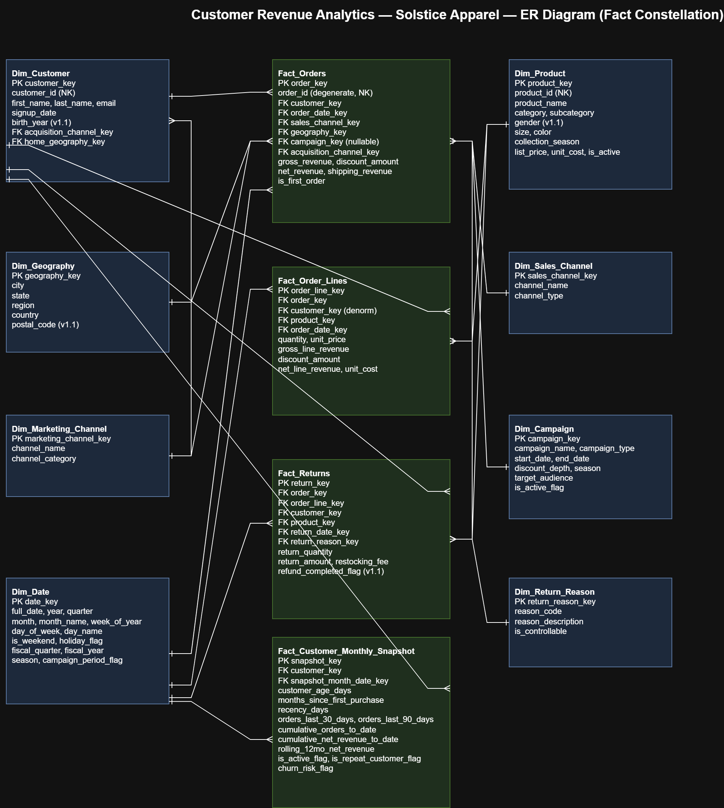

# Customer Revenue Analytics — Solstice Apparel Co.

A production-grade analytical data warehouse for a fictional direct-to-consumer apparel brand, built to answer one question that every subscription-adjacent retail business eventually faces:

> **Is our growth actually coming from customers who stay — or are we renting revenue from acquisition spend?**

This repository is a **certified, fully reproducible dimensional warehouse**: a fact-constellation schema over three years of deterministically generated synthetic transaction history, with every table validated against its specification *and* the warehouse validated against itself. It is engineered the way a real analytics-engineering team would build it — documentation-first, phase-gated, and validated at every layer.

<!-- BADGES: replace OWNER/REPO once published. These render once the repo is public. -->

-success)


---

## Table of Contents

- [Overview](#overview)
- [The Business Problem](#the-business-problem)
- [Business Context](#business-context)
- [Project Objectives](#project-objectives)
- [Architecture Overview](#architecture-overview)
- [Warehouse Design](#warehouse-design)
- [Technology Stack](#technology-stack)
- [Repository Structure](#repository-structure)
- [Engineering Methodology](#engineering-methodology)
- [Synthetic Data Generation Philosophy](#synthetic-data-generation-philosophy)
- [Validation Methodology](#validation-methodology)
- [Key Engineering Decisions](#key-engineering-decisions)
- [Warehouse Certification](#warehouse-certification)
- [KPIs Supported](#kpis-supported)
- [Analytical Capabilities](#analytical-capabilities)
- [Reproducibility & Setup](#reproducibility--setup)
- [Project Execution Order](#project-execution-order)
- [Expected Outputs](#expected-outputs)
- [Roadmap](#roadmap)
- [Acknowledgements](#acknowledgements)
- [License](#license)
- [Contact](#contact)

---

## Overview

**Solstice Apparel Co.** is a fictional D2C apparel and lifestyle brand with three full fiscal years of history (2023–2025) across its website, mobile app, and a third-party marketplace. This project builds the analytical warehouse that its finance, marketing, retention, merchandising, and operations teams would use to understand revenue quality, customer value, retention, and returns.

Because no real transactional data exists, the project includes a **deterministic synthetic-data generation framework** that produces a believable, internally-consistent business with seasonality, campaign lift, persona-driven purchasing, and apparel-typical return behavior, rigorous enough that the resulting KPIs land inside pre-declared validation targets rather than being reverse-engineered to look good.

| At a glance | |
|---|---|
| **Schema** | Fact constellation — 8 dimensions, 4 facts |
| **Grain** | Order · Order line · Return · Customer-month |
| **Volume** | 8,000 customers · 26,299 orders · 33,959 order lines · 5,687 returns · 147,995 monthly snapshots |
| **History** | 2023-01-01 → 2025-12-31 (1,096 days) |
| **Determinism** | Same seed → byte-identical output, every run |
| **Certification** | 62 warehouse-wide checks · 60 pass · 2 advisory findings · **0 blocking failures** |

---

## The Business Problem

Solstice is under pressure to prove that its **retention spend is paying off** rather than continuing to lean on new-customer acquisition. That single pressure fans out into concrete questions across five stakeholders:

- **CFO / VP Finance** — Is revenue growth coming from new or repeat customers? What's a realistic CLV?
- **VP Marketing** — Which acquisition channels bring in customers who actually stick around?
- **Head of Retention** — Who's at risk of churning, and which cohorts retain best?
- **VP Merchandising** — Which categories and products drive revenue vs. drive returns?
- **COO / Operations** — Where is revenue lost to returns, and which regions underperform?

The warehouse is designed so that every one of these questions is answerable without re-deriving customer state from raw order history each time.

---

## Business Context

Solstice sells five categories (Womenswear, Menswear, Outerwear, Footwear, Accessories) across owned website, mobile app, and marketplace channels, acquiring customers through paid social, paid search, organic/SEO, email/SMS, affiliate, and direct. The synthetic data deliberately encodes the real dynamics an apparel analyst would expect to find:

- **Seasonality** — spring/summer launches, a summer sale, back-to-school, a Nov–Dec holiday peak with a BFCM surge, and a January clearance.
- **Category-varying returns** — footwear runs highest due to sizing; accessories lowest.
- **Revenue concentration in repeat customers** — and, as warehouse validation *revised the original assumption*, far more concentrated than first believed (see [Warehouse Certification](#warehouse-certification)).

---

## Project Objectives

1. Model a genuine four-grain retail business as a **conformed-dimension fact constellation**.
2. Generate three years of **deterministic, reproducible, internally-consistent** synthetic data.
3. Validate at three levels: **per-table** (spec conformance), **cross-table** (the warehouse against itself), and **analytical readiness** (can the downstream analyses actually be built?).
4. Certify the warehouse as **trustworthy for analytics** before a single analytical query is written.
5. Keep an auditable **engineering-decision trail** so every non-obvious choice is defensible in review.

---

## Architecture Overview

<p align="center">
  
</p>


```
                          ┌──────────────────────────────────────────────┐
                          │              CONFORMED DIMENSIONS            │
                          │  Dim_Date  Dim_Customer  Dim_Product         │
                          │  Dim_Geography  Dim_Marketing_Channel        │
                          │  Dim_Sales_Channel  Dim_Campaign             │
                          │  Dim_Return_Reason                           │
                          └──────────────────────────────────────────────┘
                                 │            │            │           │
              ┌──────────────────┘   ┌────────┘     ┌──────┘    ┌──────┘
              ▼                      ▼              ▼           ▼
   ┌───────────────────┐  ┌───────────────────┐  ┌─────────────┐  ┌────────────────────────────────┐
   │    Fact_Orders    │  │ Fact_Order_Lines  │  │Fact_Returns │  │ Fact_Customer_Monthly_Snapshot │
   │  (order grain)    │◄─│  (line grain)     │◄─│(return grn) │  │   (customer-month grain)       │
   │  header revenue   │  │ product detail    │  │ per-line    │  │  derived state, no randomness  │
   └───────────────────┘  └───────────────────┘  └─────────────┘  └────────────────────────────────┘
```

Each fact is **additive at its own grain**; conformed dimensions let every fact be sliced the same way. Header revenue reconciles to line revenue *by construction* (a single shared simulation produces both), and the monthly snapshot reconciles to the transactional facts to the cent.

> 📌 **Recommended:** commit a rendered ER diagram (`docs/architecture/er_diagram.png`, exported from the included `docs/architecture/er_diagram.drawio`) and embed it here — GitHub does not render `.drawio` source.

---

## Warehouse Design

**Fact constellation, not a single star** — the business operates at four grains that don't collapse into each other without losing information (order header, order line, return, customer-month). The full rationale lives in [`docs/design_decisions.md`](docs/design_decisions.md); the highlights:

- **Four fact tables, four grains.** Returns are a separate fact because they have their own date, support partial quantities, and carry their own reason dimension.
- **A monthly snapshot fact** turns "how has this customer's relationship evolved?" from a repeated window-function query into a stored fact — and doubles as the labeled feature table for the Phase 10 churn model.
- **Type 1 dimensions only** — customer *analytics* (loyalty, activity, churn-risk) live as derived flags on the snapshot fact, not as pre-computed attributes on `Dim_Customer`, so the segmentation work in Phase 6 stays a real analytical exercise rather than a lookup.
- **Integer surrogate keys everywhere**, assigned deterministically in Python so the dataset is reproducible across regenerations.

Complete column-level detail: [`docs/data_dictionary.md`](docs/data_dictionary.md) · schema DDL: [`sql/schema.sql`](sql/schema.sql) · version history: [`docs/schema_changelog.md`](docs/schema_changelog.md).

---

## Technology Stack

| Layer | Tool |
|---|---|
| Warehouse engine | **DuckDB** (embedded OLAP) |
| Data generation & validation | **Python 3.11+** (pandas) |
| Transformation & validation logic | **SQL** (DuckDB dialect) |
| Modeling & documentation | Markdown, draw.io |
| Version control | Git / GitHub |

Intentionally minimal: two Python dependencies (`pandas`, `duckdb`), no build system, no orchestration layer. The complexity in this project is in the *modeling and validation*, not the toolchain.

---

## Repository Structure

```
customer-revenue-analytics/
├── data/
│   ├── database/                 # DuckDB file (gitignored; rebuilt from source)
│   └── generated/                # Deterministic CSV outputs (committed — the reproducible artifact)
├── docs/
│   ├── business_understanding.md     # Phase 1 — stakeholders, questions, KPI definitions
│   ├── data_warehouse_design.md      # Phase 2 — schema rationale
│   ├── design_decisions.md           # The "why" behind every modeling choice
│   ├── data_dictionary.md            # Column-level reference
│   ├── data_generation_strategy.md   # Personas, randomness classes, validation targets
│   ├── business_glossary.md          # Business term definitions
│   ├── schema_changelog.md           # Schema version history (frozen at v1.1)
│   ├── engineering_decision_log.md   # ED-001 … ED-011, the auditable decision trail
│   ├── phase3_build_log.md           # Phase-by-phase build record, incl. calibration stories
│   ├── phase4_validation_report.md   # Warehouse certification report
│   ├── project_roadmap.md            # Phase plan
│   └── er_diagram.drawio             # Editable ER diagram (export a .png for GitHub)
├── python/
│   ├── generators/                # 12 table generators + shared cores (personas, order sim, db utils)
│   └── validation/                # Warehouse-wide validation runner
├── sql/
│   ├── schema.sql                 # Full DDL (frozen at v1.1)
│   ├── generation/                # 12 idempotent load scripts
│   ├── verification/              # Smoke tests (mechanical checks)
│   └── validation/                # Per-table + warehouse-wide business validation
├── requirements.txt
├── .gitignore
├── LICENSE
└── README.md
```

---

## Analytics Layer

The certified warehouse is queried through a modular analytical SQL layer under [`sql/analytics/`](sql/analytics/) — one section file per business theme, each carrying a 13-field documentation header and its own validation (Type A regression against a certified KPI, or Type B independent recomputation). Phase 5 delivered the seven-section business analytics (A–G); Phase 6 is extending it with advanced customer analytics.

| File | Section |
|---|---|
| `01_executive_kpi_summary.sql` | Executive KPI Summary |
| `02_revenue_analysis.sql` | Revenue Analysis |
| `03_product_performance.sql` | Product Performance |
| `04_geographic_performance.sql` | Geographic Performance |
| `05_marketing_performance.sql` | Marketing Performance |
| `06_customer_value_retention.sql` | Customer Value & Retention |
| `07_returns_value_leakage.sql` | Returns & Value Leakage |
| `08_rfm_segmentation.sql` | RFM Segmentation |
| `09_cohort_retention.sql` | Cohort Analytics *(planned)* |
| `10_customer_lifetime_value.sql` | Historical Customer Lifetime Value *(planned)* |
| `11_pareto_concentration.sql` | Pareto & Customer Concentration *(planned)* |
| `12_behavioral_analytics.sql` | Behavioral Analytics *(planned)* |
| `13_customer_portfolio_synthesis.sql` | Customer Portfolio Synthesis *(planned)* |

The entire layer is re-validated with one command:

```bash
python python/validation/run_analytics_validation.py
# → 49/49 validations passed
```

---

## Engineering Methodology

Every phase follows the same gate, and no phase advances until the previous one passes it:

> **Design → Implement → Smoke Test → Business Validation → Evidence → Phase Gate**

Principles held throughout:

- **Documentation-first.** Every table was specified — grain, columns, derivations, dependencies — before a line of generator code was written.
- **Verification vs. validation are separate concerns.** *Smoke tests* answer "did it load correctly?" (mechanical). *Validation* answers "is it business-correct?" (semantic). They live in separate directories and never blur.
- **Explicit exceptions, never `assert`.** ETL validation raises descriptive errors that survive optimization flags and tell the operator exactly what broke.
- **Idempotent, transaction-wrapped loads.** Every load is a `BEGIN → DELETE → INSERT → verify → COMMIT`, rolled back on any mismatch, so re-running is always safe.
- **Fix the model, not the target.** When generated data missed a documented validation target, the *generator* was corrected — never the target loosened to match. The calibration stories are recorded honestly in the build log.

---

## Synthetic Data Generation Philosophy

The data is synthetic but not arbitrary. Every generated attribute falls into one of three deliberately-chosen randomness classes (full treatment in [`docs/data_generation_strategy.md`](docs/data_generation_strategy.md)):

- **Business rule (deterministic)** — one-time buyers get exactly one order; returns fall 5–21 days after purchase; campaign attribution is exact. No randomness where correctness is required.
- **Weighted random (shaped distribution)** — persona assignment, order frequency, category preference, channel mix. Believable variance with a genuine center and spread.
- **Pure random (no business meaning)** — names, exact time-of-day, specific color/size. Cheap randomness where realism carries no analytical weight.

Purchasing is driven by **six customer personas** (Loyal VIP, Fashion Enthusiast, Bargain Hunter, Seasonal Shopper, One-Time Buyer, High-Return Customer), each with documented frequency, AOV, category, and return tendencies. Personas are **computed deterministically from a seed and never stored** — so Phase 6's segmentation has to *discover* them rather than look them up.

**Determinism is a first-class guarantee.** The same seed produces the same keys and the same rows on every machine, every run. The header/line reconciliation is proven by a *byte-identical* regeneration test, not merely asserted.

---

## Validation Methodology

Validation happens at three escalating scopes:

| Scope | Question | Where |
|---|---|---|
| **Per-table** (Phase 3) | Does each table match its specification? | `sql/validation/validate_<table>.sql` |
| **Warehouse-wide** (Phase 4) | Does the whole warehouse tell one consistent story? | `sql/validation/validate_warehouse_*.sql` |
| **Analytical readiness** (Phase 4) | Can the downstream analyses actually be built on this? | `validate_warehouse_readiness.sql` |

The Phase 4 organizing principle:

> **Phase 3 validated each table against its specification. Phase 4 validates the warehouse against itself.**

Phase 4 is almost entirely **exact** (not tolerance-based) precisely because it compares the warehouse to itself — two independent derivations of the same truth must agree to the cent, and a tolerance would only hide a defect. Its flagship tier, **vintage coherence**, catches a class of corruption no per-table check can: because surrogate keys are dense and reused on regeneration, a stale parent table would pass every foreign-key check while silently referencing the wrong content. Only content-based re-derivation detects it.

The full runner (`python/validation/run_warehouse_validation.py`) is a **standing, re-runnable health check** that regenerates the certification report on demand.

---

## Key Engineering Decisions

Eleven engineering decisions are logged with full rationale in [`docs/engineering_decision_log.md`](docs/engineering_decision_log.md). A representative selection:

| ID | Decision |
|---|---|
| **ED-004** | Transaction-wrapped, idempotent loads — safe to re-run, rolled back on any row-count mismatch. |
| **ED-006** | Seeded, locally-scoped randomness — reproducibility without global RNG state. |
| **ED-007** | Foreign keys resolved by querying already-loaded parents, validating *business dependencies* rather than row counts, so the warehouse tolerates legitimate dimension growth. |
| **ED-008** | Tolerance-based validation for sampled distributions; exact validation everywhere else. |
| **ED-009** | Deterministic, never-persisted persona assignment — consistent across every fact generator, stored nowhere. |
| **ED-010** | A single shared order/line simulation produces both facts, so header↔line reconciliation is true *by construction*, proven byte-identical. |

Just as deliberately, several phases record **"no new engineering decision"** with a justification — resisting invention is itself a discipline the log demonstrates.

---

## Warehouse Certification

Phase 4 executed **62 warehouse-wide checks across 4 suites**: **60 passed, 2 advisory findings, 0 blocking failures.** Full report: [`docs/phase_documents/phase4_validation_report.md`](docs/phase_documents/phase4_validation_report.md).

| Item | Result |
|---|---|
| Tables validated | 12 (8 dimensions + 4 facts) |
| Total checks | 62 |
| Passed | 60 |
| Advisory findings | 2 |
| Blocking failures | **0** |
| **Certification status** | ✅ **CERTIFIED — trustworthy for analytics** |

**The standout finding.** The project's founding assumption — *"a growing but still minority share of revenue from repeat customers"* — was tested against the data and **the "minority" half was disproven decisively**: repeat customers are **35.6% of the base but generate 82.4% of revenue** (61.4% → 83.5% → 87.9% by year). Per the project's own rule, the *narrative was corrected, not the data*. The business tension became sharper, not weaker: Solstice is not building a repeat base — it is already *dependent* on one, and the real question is concentration risk. This is exactly the kind of finding a warehouse exists to surface.

---

## KPIs Supported

Every KPI is defined once in [`docs/business_understanding.md`](docs/business_understanding.md) and validated to resolve to a single value across independent derivation paths:

| KPI | Certified value |
|---|---|
| Order Net Revenue | $2,195,871.49 |
| Net Revenue (after returns) | $1,782,971.91 |
| Average Order Value (after discounts, before returns) | $83.50 |
| Discount Impact | 6.86% |
| Gross Margin | 63.27% |
| Return Rate (units) | 16.6% |
| Repeat Purchase Rate | 35.6% |

Also defined and ready to compute: Cohort Retention, Churn Rate, Historical & Projected CLV, RFM Score, and Pareto revenue concentration.

---

## Analytical Capabilities

Phase 4 certified — but did **not** perform — the following as constructible on this warehouse:

- **RFM segmentation** — recency/frequency/monetary inputs complete and non-degenerate for every purchasing customer.
- **Cohort retention** — all 36 signup-cohort months populated with full snapshot coverage.
- **Customer Lifetime Value** — historical CLV reconciles between snapshot and direct derivation.
- **Pareto concentration** — lifetime spend rankable across the customer base.
- **Churn modeling (Phase 10)** — supervised labels derivable from the snapshot with no boundary leakage; a rule-based baseline (`churn_risk_flag`) already present for comparison.
- **Time-series revenue** — no dead months across the 36-month history; fan-out hazard quantified (1.291 lines/order) for correct additivity in BI.

---

## Reproducibility & Setup

### Prerequisites
- Python 3.11+
- `pip`

### Installation
```bash
git clone https://github.com/tejas-jaggi/customer-revenue-analytics.git
cd customer-revenue-analytics
python -m venv .venv && source .venv/bin/activate    # Windows: .venv\Scripts\activate
pip install -r requirements.txt
```

### Rebuild the entire warehouse from source
The DuckDB file is intentionally **not** committed — the warehouse is meant to be *rebuilt*, which is the whole point of deterministic generation. The committed CSVs in `data/generated/` are the reproducible artifact; regenerating them produces byte-identical output.

```bash
# 1. Initialize the database and apply the schema
python python/generators/init_database.py

# 2. Generate + load all dimensions, then all facts (order matters — see below)
python python/generators/generate_dim_date.py
python python/generators/generate_dim_geography.py
python python/generators/generate_dim_marketing_channel.py
python python/generators/generate_dim_sales_channel.py
python python/generators/generate_dim_campaign.py
python python/generators/generate_dim_product.py
python python/generators/generate_dim_return_reason.py
python python/generators/generate_dim_customer.py
python python/generators/generate_fact_orders.py
python python/generators/generate_fact_order_lines.py
python python/generators/generate_fact_returns.py
python python/generators/generate_fact_customer_monthly_snapshot.py

# 3. Certify the warehouse
python python/validation/run_warehouse_validation.py
```

A successful run prints `62 checks | 60 passed | 2 findings | 0 blocking failures` and regenerates `docs/phase_documents/phase4_validation_report.md`.

---

## Project Execution Order

Generation order is **dependency-driven** and enforced by each generator's own dependency checks:

1. **Independent dimensions** — Date, Geography, Marketing Channel, Sales Channel, Campaign, Product, Return Reason
2. **Customer** — depends on Marketing Channel + Geography
3. **Fact_Orders** — depends on all seven dimensions above (+ Product, for revenue simulation)
4. **Fact_Order_Lines** — replays the shared order simulation; reconciles to Orders by construction
5. **Fact_Returns** — reads persisted order lines
6. **Fact_Customer_Monthly_Snapshot** — pure derivation over all transactional facts
7. **Warehouse validation** — certifies the whole system

---

## Expected Outputs

- **12 CSVs** in `data/generated/` — the deterministic, version-controlled data artifact.
- **A DuckDB database** in `data/database/` — rebuilt locally, not committed.
- **A certification report** at `docs/phase_documents/phase4_validation_report.md` — regenerated on every validation run.

---

## Roadmap

| Phase | Focus | Status |
|---|---|---|
| 1 | Business Understanding | ✅ Complete |
| 2 | Data Warehouse Design | ✅ Complete |
| 3 | Synthetic Data Generation (8 dims + 4 facts) | ✅ Complete |
| 4 | Warehouse-Wide Validation & Certification | ✅ Complete — **V1.0** |
| 5 | SQL Analytics Layer (Sections A–G) | ✅ Complete |
| 6 | Advanced Customer Analytics (RFM, CLV, cohort, Pareto) | 🔄 In progress |
| 7 | Business Insights & Recommendations | ⬜ Planned |
| 8 | Repository & Portfolio Finalization | ⬜ Planned |
| 9 | Churn Prediction Model (stretch) | ⬜ Planned |

---

## Acknowledgements

- Modeled on the standard **Kimball dimensional-modeling** methodology (fact constellations, conformed dimensions, periodic snapshot facts).
- Built as the demand-side counterpart to a separate procurement-spend-intelligence project, sharing a technical backbone but a deliberately different analytical toolkit (RFM, cohort retention, CLV, churn).
- All data is **synthetic**. Solstice Apparel Co. is fictional; any resemblance to a real company is coincidental.

---

## License

Released under the [MIT License](LICENSE).

---

## Contact

**[Tejas Jaggi]** — [jaggitejas4@gmail.com.com](mailto:jaggitejas4@gmail.com.com)
[LinkedIn](https://www.linkedin.com/in/tejas-jaggi/) · [Portfolio](https://tejas-jaggi.github.io/) · [GitHub](https://github.com/tejas-jaggi/)
